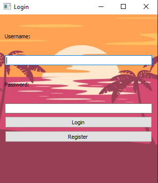
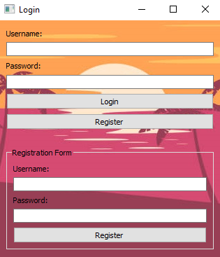

# Interface Connection

Connection interface for checking the username and password. 
It is also possible to register to create your user account and log in later.

## How to install ?

- Install dependency :

```
pip install -r requierements.txt
```


## Overview :

- Connection interface for login :



- Connection interface for register :




- Local storage password :

Passwords are stored in the file :

```
config.ini
```

It is recommended to add a password protection system like the hash because the passwords are clear in the file

## Ressources

- [PyQt5 Reference Guide](https://www.riverbankcomputing.com/static/Docs/PyQt5/ 'PyQt5 Reference Guide')
- [configparser](https://docs.python.org/3/library/configparser.html 'configparser - Configuration file parser')
- [sys](https://docs.python.org/3/library/sys.html 'System-specific parameters and functions')

